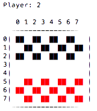

# Checkers
A work-in-progress checkers opponent I'm making for my computer science class.
Effectively, this program is designed to analyze a situation within the game of checkers and calculate the optimal decisions to make.
I am using python3 and a text-based terminal interface, though I plan to make a [curses](https://docs.python.org/3/howto/curses.html) GUI in the future.

## Requirements
- [Python3](https://www.python.org/) with pre-included modules
- Linux or OSX operating system (but it wouldn't be hard to make a windows-functioning version- maybe I'll try that sometime)
- A terminal emulator that supports [ANSI colors](https://en.wikipedia.org/wiki/ANSI_escape_code)- or else yours and the opponent's pieces are gonna look mighty similar

## Installation
There really is none. It's still in development and I'm not going to set something like that up until I reach a certain stage in production. To test, just download or clone the repository.

## Usage
To use checkers, cd into the folder containing the script and run:
``python3 checkers.py``
You should see something like this:

## TODO list/ timeline
- [x] Create initial frameworks
- [x] Create function for displaying the board
- [x] List diagonal spaces and recognize pieces
- [x] Add move planning
- [x] Add jump planning
- [ ] Support king piece moves
- [x] Support either-side moves
- [x] Allow simulation of moves
- [ ] Update the board when a move is made
- [x] Tally and judge moves by piece differential
- [x] Add recursion for moves
- [x] Add recursion depth limiter
- [ ] Add interactive player vs computer games
- [ ] Make windows-supported version
- [ ] Build and publish as V0
- [ ] Make curses game display
- [ ] Make curses move selection interface
- [ ] Build and publish as V1

## Contributors
[Me](https://github.com/aderhall)! (so lonely...)
